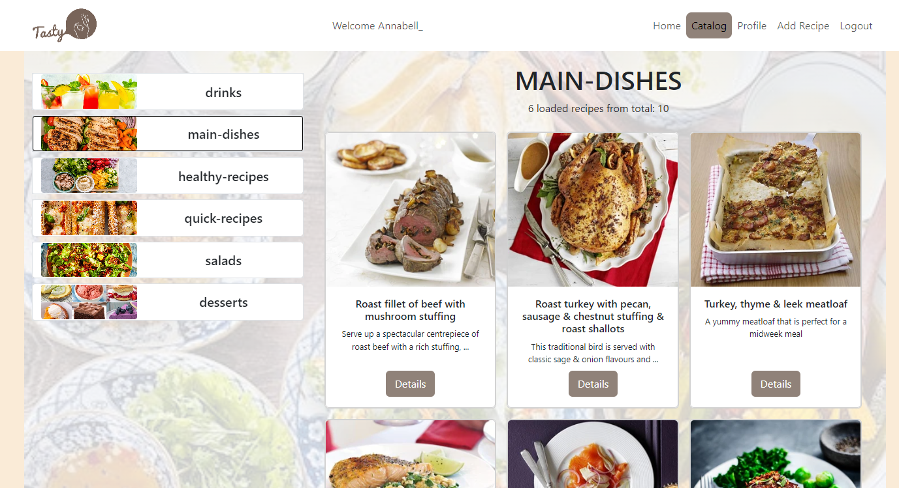

# CookBook Project with responsive design
   - This project, developed using Angular version 16.1.4 and Bootstrap framework, is dedicated to the world of cooking and recipes, enhanced by a responsive design that adapts seamlessly to different devices and screen sizes. Whether you're using a desktop, tablet, or smartphone, the project ensures an optimal and user-friendly experience. 
   - This project is for cooking enthusiasts to explore and share recipes. Users have the ability to browse recipes based on different categories, each featuring a title and an image. To access the full content of a recipe, users need to authenticate either by logging in with an existing profile or creating a new one. Once logged in, users can enjoy various features:
## Features
- Recipe Category Selection: Users can choose a specific category to view a list of recipes depending to their preferences.
  - Initial Load: When the page loads, the first set of 6 recipes is fetched from the server and displayed.
  - Load More: The "Load More" button is displayed at the bottom of the list of recipes.
When the button is clicked, a request is sent to the server to fetch the next set of 6 recipes.
The new recipes are added to the existing list, and the page might scroll to show the newly loaded recipes.

- Detailed Recipe Information: Logged-in users can access detailed information about each recipe, including ingredients, preparation steps, and cooking instructions.

- User Authentication and Profiles: The platform provides a secure authentication system. Users can create a profile, log in, and access personalized features based on their account.

- Adding New Recipes: Authenticated users can contribute to the platform by adding their own recipes. They can provide all necessary details, such as ingredients, preparation time, and images.

- Category Creation: If users discover a missing category, they have the ability to add new recipe categories, ensuring a diverse and comprehensive collection.

- Recipe Editing and Deletion: Users have full control over recipes they've contributed. They can edit the details of their recipes, including updating ingredients or modifying cooking instructions. Additionally, users can choose to remove their own recipes from the platform.
- Profile: In this project, every registered user has a dedicated profile page that allows them to manage and interact with their own recipes. 

 

## Install dependencies: 

`npm install`

## Run project:

Run `ng serve` for a dev server. 
Navigate to `http://localhost:4200/`. The application will automatically reload if you change any of the source files.

## Data source:
 DummyJSON: https://dummyjson.com/docs/products
